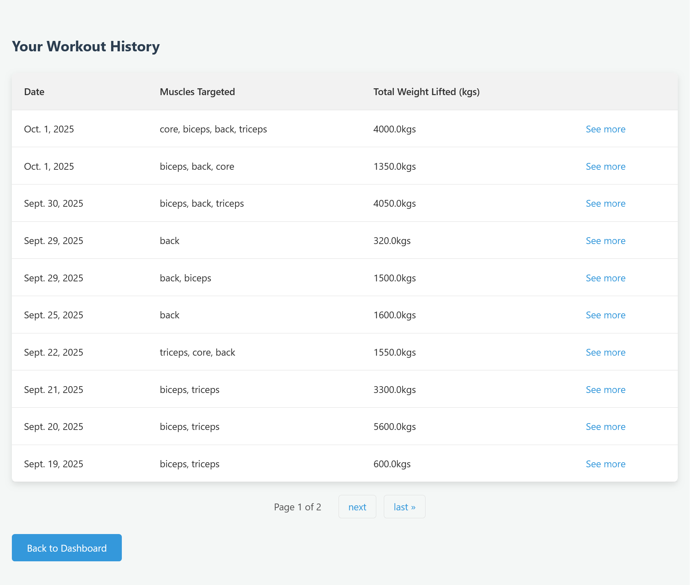

# FitSight - Fitness Tracking Application


## 📋 Table of Contents
- [About The Project](#-about-the-project)
- [Features](#-features)
- [Built With](#-built-with)
- [Getting Started](#-getting-started)
  - [Prerequisites](#prerequisites)
  - [Installation](#installation)
- [Usage](#-usage)
- [Project Structure](#-project-structure)
- [Database Schema](#-database-schema)
- [Screenshots](#-screenshots)
- [Contributing](#-contributing)
- [License](#-license)
- [Contact](#-contact)
- [Acknowledgments](#-acknowledgments)

### 📖 About The Project

**FitSight** is a comprehensive fitness tracking web application designed to help users monitor their workout progress, visualize their gains, and achieve their fitness goals. Built with Django, this application provides an intuitive interface for logging workouts, tracking exercise performance, and analyzing training patterns over time.

This project was developed as a major academic project to demonstrate full-stack web development skills, database management, and modern web application architecture using the Django framework.

### 🎯 Project Objectives
- Create a user-friendly fitness tracking system
- Implement secure user authentication and authorization
- Provide real-time workout logging capabilities
- Visualize user progress through interactive charts and graphs
- Design a responsive and modern user interface
- Demonstrate proficiency in Django framework and web development best practices

### ✨ Features

### User Management
- **User Registration & Authentication**: Secure signup and login system
- **Custom User Profile**: Extended user model with fitness-specific fields (DOB, gender, height, weight)
- **Profile Management**: Update personal information and fitness metrics

### Workout Tracking
- **Live Workout Sessions**: Real-time logging of exercises, sets, reps, and weights
- **Exercise Library**: Custom exercise database with muscle group categorization
- **Auto-fill Feature**: Automatically suggests last used weight and reps for each exercise
- **Workout History**: Complete history of all workout sessions with pagination

### Analytics & Visualization
- **Dashboard Overview**: At-a-glance view of fitness statistics
- **Progress Charts**: 
  - Total volume lifted over time (line chart)
  - Workout frequency (bar chart - weekly/monthly view)
  - Muscle group distribution (pie chart)
- **Exercise Progress Tracking**: Individual exercise progression with max weight and total volume metrics
- **Session Statistics**: Total weight lifted and muscle groups targeted per session

### User Experience
- **Responsive Design**: Clean, modern interface that works across devices
- **Interactive Charts**: Dynamic visualizations using Chart.js
- **Easy Navigation**: Intuitive flow from session creation to workout logging
- **Data Validation**: Form validation to ensure data integrity

### 🛠️ Built With

### Backend
- **Django 5.2.6** - High-level Python web framework
- **SQLite3** - Lightweight database for development
- **Python 3.x** - Programming language

### Frontend
- **HTML5** - Markup language
- **CSS3** - Styling and layout
- **JavaScript (ES6)** - Client-side interactivity
- **Chart.js** - Data visualization library

### Tools & Libraries
- **Django ORM** - Database abstraction layer
- **Django Forms** - Form handling and validation
- **Django Authentication** - User authentication system

## 🚀 Getting Started

### Prerequisites

Before you begin, ensure you have the following installed:
- Python 3.8 or higher
- pip (Python package installer)
- Git

### Installation

1. **Clone the repository**
   ```bash
   # Clone the repository
   # Replace with your own fork if needed
   git clone https://github.com/GauravChanda7/fitsight.git
   cd fitsight
   ```

2. **Create a virtual environment**
   ```bash
   # On Windows
   python -m venv venv
   venv\Scripts\activate

   # On macOS/Linux
   python3 -m venv venv
   source venv/bin/activate
   ```

3. **Install dependencies**
   ```bash
   pip install -r requirements.txt
   ```

4. **Apply database migrations**
   ```bash
   python manage.py makemigrations
   python manage.py migrate
   ```

5. **Create a superuser (admin account)**
   ```bash
   python manage.py createsuperuser
   ```
   Follow the prompts to create your admin credentials.

6. **Run the development server**
   ```bash
   python manage.py runserver
   ```

7. **Access the application**
   - Open your browser and navigate to: `http://127.0.0.1:8000/`
   - Admin panel: `http://127.0.0.1:8000/admin/`

### 💡 Usage

### First Time User

1. **Sign Up**: Create a new account from the landing page
2. **Update Profile**: Add your fitness metrics (height, weight, DOB)
3. **Create Exercise**: Add exercises to your personal exercise library
4. **Start Workout**: Begin a new workout session
5. **Log Sets**: Record your sets with reps and weight
6. **View Progress**: Check your dashboard for analytics and insights

### Daily Workflow

1. Navigate to Dashboard
2. Click "Start a New Workout"
3. Select the workout date
4. Log your exercises and sets
5. End session when complete
6. Review your progress in the dashboard

### Dashboard Features

- **Recent Activity**: View your last 5 workout sessions
- **Monthly Statistics**: See total sessions and workouts this month
- **Volume Chart**: Track total weight lifted over the last 100 days
- **Frequency Chart**: Toggle between weekly (7 days) and monthly (30 days) workout frequency
- **Muscle Distribution**: Pie chart showing muscle groups trained in the last 60 days

### 📁 Project Structure

```
fitsight/
│
├── accounts/                      
│   ├── migrations/
│   ├── static/
│   │   └── accounts/
│   │       ├── css/              
│   │       └── js/               
│   ├── templates/
│   │   └── accounts/             
│   ├── admin.py                  
│   ├── forms.py                  
│   ├── models.py                 
│   ├── urls.py                   
│   └── views.py                  
│
├── fitness_tracking/              
│   ├── migrations/
│   ├── static/
│   │   └── fitness_tracking/
│   │       ├── css/              
│   │       └── js/               
│   ├── templates/
│   │   └── fitness_tracking/     
│   ├── admin.py                  
│   ├── forms.py                  
│   ├── models.py                 
│   ├── urls.py                   
│   └── views.py                  
│
├── fitsight_project/              
│   ├── __init__.py
│   ├── asgi.py
│   ├── settings.py               
│   ├── urls.py                   
│   └── wsgi.py
│
├── templates/                     
│   └── base.html                 
│
├── .gitignore                     
├── manage.py                      
├── README.md                      
└── requirements.txt               
```

### 🗄️ Database Schema

### Models Overview

#### CustomUser (extends Django's AbstractUser)
```python
- username: CharField (inherited)
- email: EmailField (unique)
- password: CharField (inherited)
- first_name: CharField (inherited)
- last_name: CharField (inherited)
- date_of_birth: DateField
- gender: CharField (choices: M/F/O/P)
- height_cm: FloatField
- weight_kg: FloatField
```

#### WorkoutSession
```python
- id: AutoField (PK)
- user: ForeignKey -> CustomUser
- date: DateField
```

#### Exercise
```python
- id: AutoField (PK)
- user: ForeignKey -> CustomUser
- exercise_name: CharField
- muscle_group: CharField (choices: chest/back/legs/biceps/triceps/shoulders/core)
- unique_together: (user, exercise_name)
```

#### Set
```python
- id: AutoField (PK)
- session: ForeignKey -> WorkoutSession
- exercise_name: ForeignKey -> Exercise
- reps: PositiveSmallIntegerField
- weight_kg: FloatField
```

### Database Relationships
```
CustomUser (1) ─────< (N) WorkoutSession
CustomUser (1) ─────< (N) Exercise
WorkoutSession (1) ─< (N) Set
Exercise (1) ───────< (N) Set
```

### 📸 Screenshots

### Landing Page
*Clean, professional landing page introducing FitSight's key features*


### Dashboard
*Comprehensive overview with charts showing progress, frequency, and muscle distribution*


### Live Workout
*Real-time workout logging with auto-fill functionality*


### Exercise Progress
*Detailed progress tracking for individual exercises*


### Workout History
*Paginated view of all past workout sessions*



### 🤝 Contributing

Contributions are what make the open-source community such an amazing place to learn, inspire, and create. Any contributions you make are **greatly appreciated**.

1. Fork the Project
2. Create your Feature Branch (`git checkout -b feature/AmazingFeature`)
3. Commit your Changes (`git commit -m 'Add some AmazingFeature'`)
4. Push to the Branch (`git push origin feature/AmazingFeature`)
5. Open a Pull Request

### 📄 License

Distributed under the MIT License. See `LICENSE` for more information.

### 📧 Contact

Gaurav Chanda - [gauravchanda2022@gmail.com](mailto:gauravchanda2022@gmail.com)

Project Link: [https://github.com/GauravChanda7/fitsight](https://github.com/GauravChanda7/fitsight)

### 🙏 Acknowledgments

### Resources & Inspiration
- [Django Documentation](https://docs.djangoproject.com/)
- [Chart.js Documentation](https://www.chartjs.org/docs/latest/)
- [MDN Web Docs](https://developer.mozilla.org/)
- [Stack Overflow Community](https://stackoverflow.com/)

### Special Thanks
- My academic advisor and mentors for their guidance
- Fellow students for their feedback and support
- The Django and open-source community

---

### 📝 Additional Notes for Academic Submission

### Key Learning Outcomes
- Full-stack web development using Django framework
- Database design and ORM implementation
- User authentication and authorization
- RESTful API design for AJAX requests
- Data visualization and front-end interactivity
- Form validation and error handling
- Responsive web design principles

### Technologies Demonstrated
- **Backend**: Python, Django, SQLite
- **Frontend**: HTML5, CSS3, JavaScript (ES6)
- **Security**: CSRF protection, authentication decorators, password validation
- **Database**: Relational database design, Django ORM, queries and aggregations
- **Version Control**: Git, GitHub

### Future Enhancements
- [ ] Add PostgreSQL database for production
- [ ] Implement workout templates and programs
- [ ] Add social features (follow users, share workouts)
- [ ] Mobile app development (React Native)
- [ ] Add exercise video tutorials
- [ ] Implement REST API with Django REST Framework
- [ ] Add export functionality (CSV, PDF)
- [ ] Integrate nutrition tracking
- [ ] Add AI-powered workout recommendations

---

**Developed with 💪 by Gaurav Chanda | Academic Year 2024-2025**
